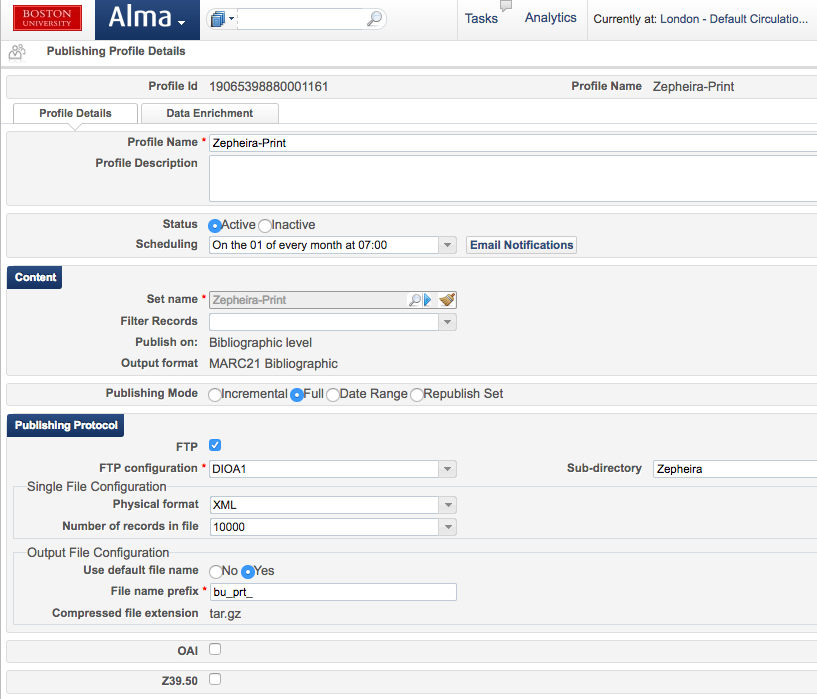
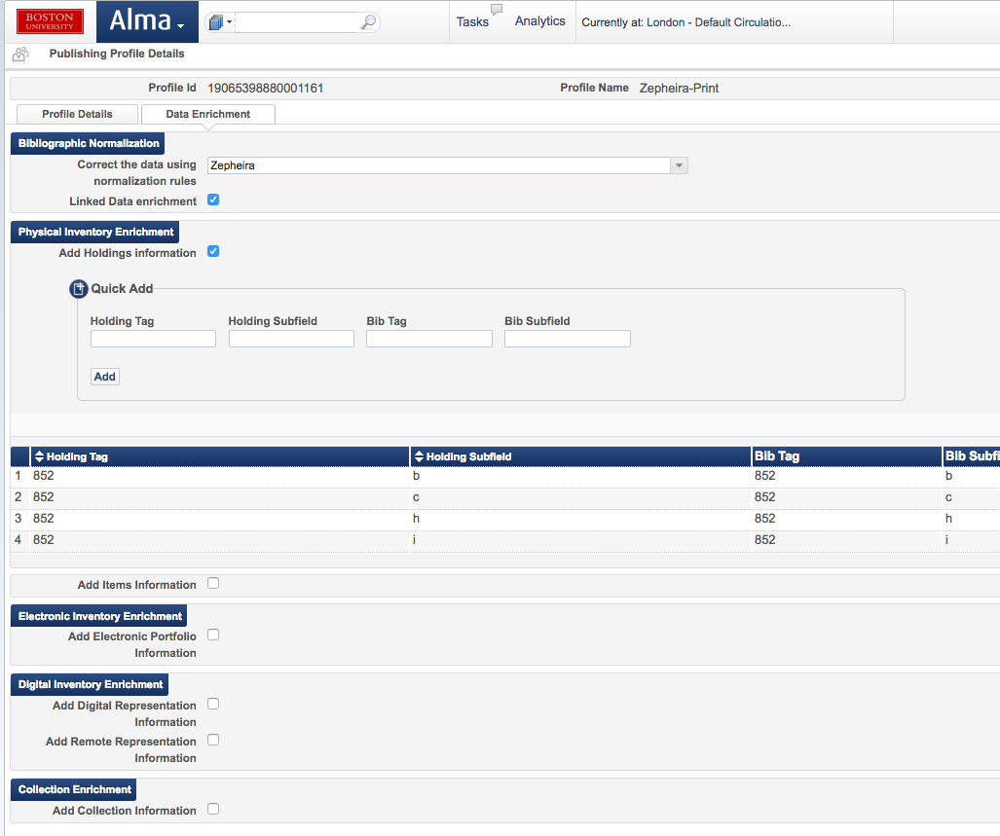

# library-link-network-demo 
Boston University Libraries began working with Zepheira and other library partners in 2015 to publish bibliographic data using the Bibframe schema (in addition to other linked data schemas) to web sites that can be indexed by standard Internet search engines like Google, Bing, Yahoo, etc. The files in this repository are files that are associated with processing and enhancing the bibliographic record and making them discoverable on the web. 
  
The process described and the code provided are admittedly BU-centric, but they are shared here with the hope that they might be helpful to those interested in similar projects. BU Libraries use Ex Libris Alma and Primo as the resource management and discovery systems. In addition, the Libraries maintain a Dspace repository called OpenBU (http://open.bu.edu). The process described here was developed in the context of those systems. 
  
On a regular basis (currently monthly), BU Libraries upload a full set of the bibliographic records maintained in Alma and Dspace.  
 
## Harvesting records from Dspace 
The bibliographic records from Dspace are harvested using an OAI-PMH harvesting protocol. We currently harvest all available collections and do a full harvest each month. The python script "HarvestOpenBUrecords.py" found in this repository is used to harvest the records. When run, it does a full harvest of all of the records in the Dspace repository, modifies the marcxml records slightly, and writes the records out to a marcxml file. Finally, it tar-zips the file and places it in the appropriate directory for upload to Zepheira. This script can either be run manually from the command line ($ *python HarvestOpenBUrecords.py*) or scheduled to run on a cron job. Currently, we are making no enhancements to the Dspace records.  
 
## Publishing records from Alma 
We scheduled the jobs to publish bibliographic records to run on a monthly basis. Configuring these publishing jobs begins with creating one more logical managed sets. In non-Alma speak, this essentially means that we create a search query on bibliographic records in the repository that is a dynamic query. New bibliographic records added to Alma that meet the search criteria are automatically added to the search results when it is run. We publish almost all of our bibliographic records, but wanted to add a couple criteria to eliminate any records that do not yet have inventory or are suppressed. It was easiest for us to do so by creating two managed sets, one for physical titles and one for electronic titles.  
 
After the managed sets are created, we configured publishing profiles by going to: 
  
**Resource Management > Resource Configuration > Configuration Menu > Record Export > Publishing Profiles** 
  
Here we created a general publishing profile that publishes the records in marcxml format and places them on the Libraries' FTP server. When configuring each publishing profile, provide the name of the managed set that is to be published, define the size of the output files (we use 10,000 records per file) and the FTP server location. Indicate that the publishing job should publish the FULL set and that the physical format should be XML. 
  
 
  
The data enrichment tab allows one to turn on Linked Data enrichment. This adds a subfield zero for authorized headings. It is possible to add inventory level data to the bib records. We do this for holding information, but it isn't currently being used by Zepheira. It is also possible to use Alma normalization rules to correct or modify the bib records as they are exported. We discovered that some CKB data was being published that was unhelpful. Also the '(uri)' prefixes to subfield zero need to be stripped. We have a local cataloging practice of converting 856 fields to 956 so that they don't display in the links section in Primo. Our normalization rules convert the 956 fields back to 856. A copy of our normalization rules  (*ZepheiraPublishNormalizationRules.txt*) can be found in this repository. We do some processing of the files after they are published, but we could expand this set of normalization rules to perform additional modifications to the bib records if we chose. 
  
 
 
  
We currently have these two jobs scheduled to run on the first day of the month beginning at 7:00am. It generally requires 10-12 hours to complete. When the publishing jobs are complete the the 330+ files are placed on the Libraries' FTP server. At this point, the files can be uploaded to Zepheira for conversion to Bibframe and publishing to the link.bu.edu web site. We did that for several months. 
  
## Enhancing records from Alma 
  
A few months ago, Ex Libris began adding the ability to enrich records with linked data elements located in subfield zero of authority controlled fields. I was particularly interested in the inclusion of links to Wikidata that were being included. After exploring, I discovered that the links were actually to a resolver that attempted to use the LC authority number to get the Wikidata record. This proved to be problematic, though because the presence of the resolver link didn't guarantee that a link actually existed in Wikidata. In addition, the resolver frequently timed out. It didn't seem wise to publish the resolver links to the web, so I wrote a script that stripped out any subfield zero that linked to a source through the Ex Libris resolver.  
 
We began wondering about adding additional data sources to our records. I began exploring possibilities and discovered that the Wikidata database included links to both VIAF and Library of Congress authority files. I did a small test querying the Wikidata api. While I got reliable results, it simply wasn't scalable to do 3 million plus queries every time we published records. Based on the results, though, using the Wikidata database seemed promising. I downloaded the database in a comma separated format (9+ GB) and wrote a script that parsed the database to begin building a sqlite lookup table. While I've achieved reasonable scale, I still don't think it makes sense for every library to be doing this. I'm still treating it as a proof of concept. The enhanced records do provide us with a rich set of records to publish to the web and to begin experimenting with in Primo. I am particularly interested to monitor how the enhancement of records affects ranking in Google results and other metrics that we can monitor in Google Analytics.  
 
The schema for the sqlite database ( *wiki_schema.sql* ) is located in this repository. I elected to use the Wikidata property labels as the column names. The script that downloads the Wikidata database and builds the wikidata lookup table is in this repository. ( *buildLookup.py* ) 
  
In early testing and the development of the workflow, we processed the bibliographic records on a MacBook Pro. The processing has since been moved to a Linux cluster that allows the jobs to be queued to run in a more robust computing environment. Two scripts do the work of transferring the files from the ftp server, preparing them to be processed, and processing each record. 
  
###Preparing the files to be processed 
The first script ( *get_files_and_submit_jobs.py* ) logs onto the ftp server and copies all of the files that were published from Alma to the Linux cluster where they will be processed. The script copies them to the "extract" directory, then distributes them to multiple directories ("e1", "e2", ..., "e30") so that multiple processing jobs can be queued to run. We typically queue 30 jobs to run, but the number is configurable by adding a command line parameter. To avoid database locking conflicts, a copy of the lookup database is created for each job to be queued. Then the job is submitted to the job queue using: by calling the script: ( *enhance_bib_records_with_linked_data_sourcces.py* ). 
  
###Processing the bibliographic records 
The *enhance_bib_records_with_linked_data_sourcces.py* script is written to take advantage of multiple processors. It was developed on the MacBook Pro that has four processors and 8 GB of memory. There was a definite improvement in processing speed over a single processor. The script reads and opens each marcxml file. Each field in each record is examined to detect the presence of a subfield zero containing a Library of Congress authority number. If found, this value is used to query the lookup table to determine if links to other authority sources can be added. If found, a subfield zero is added to the field for each additional authority source in the lookup table. Each record is then written to an output file in the "publish" directory that is tar-zipped in preparation for upload to the Zepheira loader. These files are written with 100,000 records per file. For help in identifying records that have been enhanced, a copy of each enhanced record is written to a separate file in the "changed" directory. These are used for testing locally. 
  
Depending on available computing resources on the linux cluster, These two scripts require approximately three hours to run to process 3+ million bibliographic records. 
  
###Upload 
Finally, the processed records are uploaded using the Zepheira loader. A script ( *upload.py* ) is used to upload the files.  
 
 
 